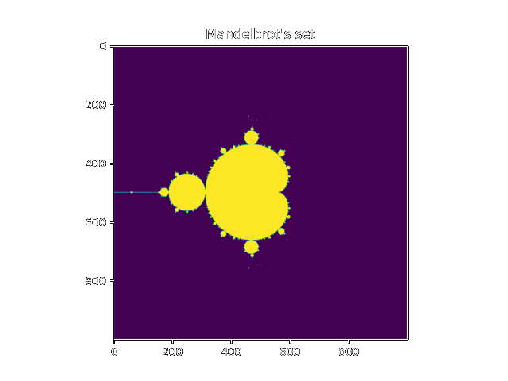

# Fractales
Mandelbrot's set and Julia's sets.



## description
### languages :
-	Python
-	C++
### dependencies : 
- Python :
	- matplotlib
	- numpy
	- cmath (for the version written all in python)
- C++ : 
	- complex
### versions
- [C++] + [Python]
	- computation in C++ for speed
	- plot in python with matplotlib
 - full [Python]
	 - all in Python,easy to understand, but very slow
## how to install and run ?

``` git clone https://github.com/nobody48sheldor/fractales ```

``` cd fractales/ ```

- [C++] + [Python]

``` sh compile.sh ``` (needs g++ compiler)

- full [Python]

``` cd full_python/ ```

``` python3 mandelbrot.py ``` or ``` python3 julia_set.py ```

## contribute
you can copy the code update/modify it and do a pull request.

